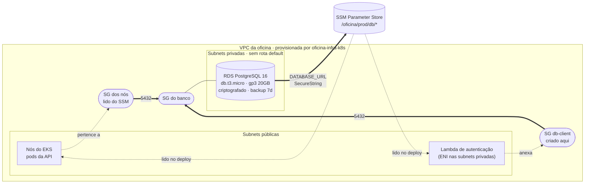

# oficina-infra-db

Infraestrutura como código do **banco de dados gerenciado** da Oficina Mecânica.
Repositório 3 de 4 do Tech Challenge — Fase 3.

Provisiona um **Amazon RDS PostgreSQL** nas subnets privadas da VPC criada por
[oficina-infra-k8s](https://github.com/Xikin/oficina-infra-k8s), substituindo o `Deployment` de Postgres
que rodava dentro do cluster na Fase 2.

| Repositório | Papel |
| --- | --- |
| [oficina-auth-lambda](https://github.com/Xikin/oficina-auth-lambda) | Function serverless de autenticação por CPF + API Gateway |
| [oficina-infra-k8s](https://github.com/Xikin/oficina-infra-k8s) | VPC + cluster EKS + metrics-server |
| **oficina-infra-db** (este) | RDS PostgreSQL gerenciado |
| [oficina-mvp](https://github.com/Xikin/tech_challenge) | Aplicação principal executando no cluster |

---

## Arquitetura desta stack



### Decisões que valem explicar

**Acesso por security group, não por CIDR.** O SG do banco só aceita a porta 5432
vinda de dois grupos: o SG dos nós do EKS (a API) e um SG "crachá" chamado
`db-client` que a Lambda anexa à própria ENI. Nenhuma regra usa faixa de IP e nada
está aberto para `0.0.0.0/0`.

**Subnets privadas sem rota default.** O banco não tem IP público e a subnet onde
ele vive nem sequer tem rota para o Internet Gateway. `publicly_accessible = false`
é redundância proposital.

**Senha alfanumérica de 40 caracteres.** A senha entra numa connection string; `%`,
`#`, `?` e `:` mudariam o significado da URL e quebrariam o parser do Prisma de
formas difíceis de diagnosticar. 40 caracteres alfanuméricos dão ~238 bits de
entropia sem exigir escape nenhum.

**SSM SecureString em vez de Secrets Manager.** SecureString usa a chave KMS
gerenciada da AWS e é gratuito; Secrets Manager cobraria US$0,40/segredo/mês por uma
rotação automática que este escopo não usa.

**Parameter group próprio.** Sem ele não dá para ligar `log_min_duration_statement`,
que é a fonte do painel de queries lentas no New Relic.

---

## Tecnologias

| Camada | Tecnologia |
| --- | --- |
| IaC | Terraform ~> 1.10 (backend S3 com lock nativo) |
| Banco | Amazon RDS PostgreSQL 16, `db.t3.micro`, gp3 criptografado |
| Segredos | SSM Parameter Store (SecureString, KMS gerenciada) |
| Observabilidade | Performance Insights + export de logs para CloudWatch |
| CI/CD | GitHub Actions — `plan` no PR, `apply` no merge |

---

## Por que PostgreSQL gerenciado

A justificativa formal da escolha do motor e do modelo relacional está em
[oficina-mvp/docs/modelo-de-dados.md](https://github.com/Xikin/tech_challenge/blob/main/docs/modelo-de-dados.md),
com o diagrama ER e a explicação dos relacionamentos.

Em resumo, o que muda em relação à Fase 2 não é o motor — continua PostgreSQL —
mas **onde ele roda**:

| | Fase 2 (Deployment no cluster) | Fase 3 (RDS) |
| --- | --- | --- |
| Backup | nenhum | automático, retenção de 7 dias |
| Patch de versão | manual | `auto_minor_version_upgrade` |
| Disponibilidade | morre junto com o nó | Multi-AZ disponível por variável |
| Isolamento | disputa CPU com a API | instância dedicada |
| Métricas | nenhuma | Performance Insights + CloudWatch |

---

## Execução

> Esta stack **depende** de `oficina-infra-k8s` já aplicada — ela lê a VPC, as
> subnets privadas e o SG dos nós do SSM. O pipeline falha com mensagem explícita
> se a rede ainda não existir.

```bash
terraform init \
  -backend-config="bucket=oficina-tfstate-<ACCOUNT_ID>" \
  -backend-config="region=us-east-1" \
  -backend-config="key=infra-db/prod/terraform.tfstate"

cp terraform.tfvars.example terraform.tfvars
terraform plan
terraform apply     # ~8 a 10 min
```

### Recuperar a connection string

```bash
# pelo Terraform
terraform output -raw database_url

# ou direto do SSM, de qualquer máquina autenticada
aws ssm get-parameter \
  --name /oficina/prod/db/database_url \
  --with-decryption --query Parameter.Value --output text
```

As migrations do Prisma são aplicadas pela **aplicação**, não por esta stack: o
`CMD` do container roda `npx prisma migrate deploy` no start. Ver
[oficina-mvp](https://github.com/Xikin/tech_challenge).

### Destruir entre sessões de estudo

```bash
terraform destroy
```

`skip_final_snapshot = true` e `deletion_protection = false` são propositais para
o laboratório — num ambiente real ambos seriam o oposto.

---

## Deploy automático

| Gatilho | O que acontece |
| --- | --- |
| PR para `main` ou `homolog` | `fmt` + `validate` + `plan`, com o plano comentado no PR |
| Push em `homolog` | `apply` no banco de homologação |
| Push em `main` | `apply` no banco de produção |
| `workflow_dispatch` com `destroy` | `terraform destroy` do ambiente da branch |

### Secrets necessários no repositório

| Secret | Origem |
| --- | --- |
| `AWS_ACCESS_KEY_ID` | Learner Lab → AWS Details → AWS CLI |
| `AWS_SECRET_ACCESS_KEY` | idem |
| `AWS_SESSION_TOKEN` | idem — **expira a cada 4h** |
| `TF_STATE_BUCKET` | `oficina-infra-k8s/bootstrap/backend.sh` |

---

## O que esta stack publica no SSM

| Parâmetro | Tipo | Consumido por |
| --- | --- | --- |
| `/oficina/<env>/db/database_url` | SecureString | oficina-mvp, oficina-auth-lambda |
| `/oficina/<env>/db/password` | SecureString | — (diagnóstico) |
| `/oficina/<env>/db/endpoint` | String | diagnóstico |
| `/oficina/<env>/db/name` | String | diagnóstico |
| `/oficina/<env>/db/username` | String | diagnóstico |
| `/oficina/<env>/db/client_security_group_id` | String | oficina-auth-lambda |

## API

Este repositório não expõe API. A API da oficina é documentada em
[oficina-mvp](https://github.com/Xikin/tech_challenge) — Swagger em `/docs` e collection Postman versionada.
